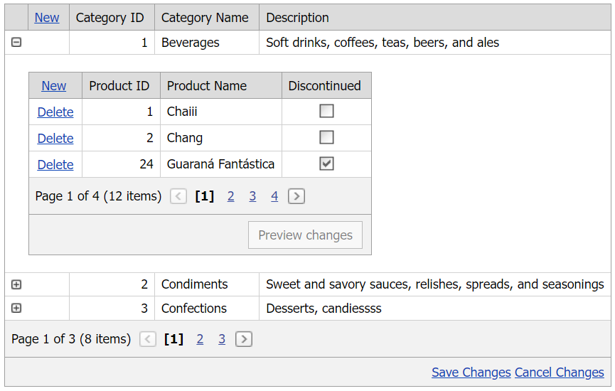

<!-- default badges list -->

[](https://supportcenter.devexpress.com/ticket/details/T146190)
[](https://docs.devexpress.com/GeneralInformation/403183)
<!-- default badges end -->
# Grid View for ASP.NET Web Forms - How to update master and detail grids simultaneously in batch edit mode
<!-- run online -->
**[[Run Online]](https://codecentral.devexpress.com/128543288/)**
<!-- run online end -->

This example demonstrates how to implement master-detail functionality and update all grid controls on a custom button click in batch edit mode.



## Overview

Follow the steps below to update master and detail grids simultaneously:

1. Create a master grid control, specify its [Templates.DetailRow](https://docs.devexpress.com/AspNet/DevExpress.Web.GridViewTemplates.DetailRow) property, and add a detail grid to the template.

2. Hide default command buttons in the grid's server-side [CommandButtonInitialize](https://docs.devexpress.com/AspNet/DevExpress.Web.ASPxGridView.CommandButtonInitialize) event handler and use the master grid's [StatusBar](https://docs.devexpress.com/AspNet/DevExpress.Web.GridViewTemplates.StatusBar) property to create custom **Save Changes** and **Cancel Changes** buttons.

    ```aspx
    <Templates>
        <!-- ... -->
        <StatusBar>
            <div style="text-align: right">
                <dx:ASPxButton ID="btn" Text="Save Changes" RenderMode="Link" AutoPostBack="false" runat="server">
                    <ClientSideEvents Click="OnClick" />
                </dx:ASPxButton>
                <dx:ASPxButton ID="btn2" Text="Cancel Changes" RenderMode="Link" AutoPostBack="false" runat="server">
                    <ClientSideEvents Click="OnCancel" />
                </dx:ASPxButton>
            </div>
        </StatusBar>
    </Templates>
    ```

    ```csharp
    protected void Grid_CommandButtonInitialize(object sender, ASPxGridViewCommandButtonEventArgs e) {
        if (e.ButtonType == ColumnCommandButtonType.Update || e.ButtonType == ColumnCommandButtonType.Cancel) {
            e.Visible = false;
        }
    }
    ```

3. Handle the master grid's client-side [DetailRowCollapsing](https://docs.devexpress.com/AspNet/js-ASPxClientGridView.DetailRowCollapsing) and [DetailRowExpanding](https://docs.devexpress.com/AspNet/js-ASPxClientGridView.DetailRowExpanding) events to get the visible indexes of expanded rows.

    ```js
    var visibleIndicies = [];
    function AddCurrentDetailGrid(visibleIndex) {
    if (visibleIndicies.indexOf(visibleIndex) == -1)
        visibleIndicies.push(visibleIndex);
    }
    function RemoveCurrentDetailGrid(visibleIndex) {
        var arrayIndex = visibleIndicies.indexOf(visibleIndex);
        if (arrayIndex > -1)
            visibleIndicies.splice(arrayIndex, 1);
    }
    function OnExpanding(s, e) {
        AddCurrentDetailGrid(e.visibleIndex);
    }
    function OnCollapsing(s, e) {
        RemoveCurrentDetailGrid(e.visibleIndex);
    }
    ```

4. In the custom button's `Click` event handler, call the master grid's `PerformCallback` method to update all grid controls on the server.

    ```js
    var buttonFlag = false;
    function OnClick(s, e) {
        if (visibleIndicies.length == 0)
            grid.UpdateEdit();
        else {
            buttonFlag = true;
            grid.PerformCallback(visibleIndicies);
        }
    }
    ```

5. Handle the master grid's server-side [CustomCallback](https://docs.devexpress.com/AspNet/DevExpress.Web.ASPxGridView.CustomCallback) event. In the handler, call the master grid's [FindDetailRowTemplateContol](https://docs.devexpress.com/AspNet/DevExpress.Web.ASPxGridView.FindDetailRowTemplateControl(System.Int32-System.String)) method to access all detail grids and use their [UpdateEdit](https://docs.devexpress.com/AspNet/DevExpress.Web.ASPxGridView.UpdateEdit) methods to update data.

    ```csharp
    protected void Grid_CustomCallback(object sender, ASPxGridViewCustomCallbackEventArgs e) {
        ASPxGridView parentGrid = sender as ASPxGridView;
        parentGrid.UpdateEdit();
        parentGrid.DataBind();
        if (String.IsNullOrEmpty(e.Parameters))
            return;
        string[] paramArray = e.Parameters.Split(',');
        for (int i = 0; i < paramArray.Length; i++) {
            if (String.IsNullOrWhiteSpace(paramArray[i]))
                continue;
            ASPxGridView child = parentGrid.FindDetailRowTemplateControl(Convert.ToInt32(paramArray[i]), "grid2") as ASPxGridView;
            if (child != null) {
                child.UpdateEdit();
                child.DataBind();
            }
        }
    }
    ```

## Files to Review

* [Default.aspx](./CS/WebSite/Default.aspx) (VB: [Default.aspx](./VB/WebSite/Default.aspx))
* [Default.aspx.cs](./CS/WebSite/Default.aspx.cs) (VB: [Default.aspx.vb](./VB/WebSite/Default.aspx.vb))
* [UpdateLogic.js](./CS/WebSite/UpdateLogic.js) (VB: [UpdateLogic.js](./VB/WebSite/UpdateLogic.js))

## Documentation

* [Master-Detail Relationship](https://docs.devexpress.com/AspNet/3772/components/grid-view/concepts/master-detail-relationship)
* [Grid View Templates](https://docs.devexpress.com/AspNet/3718/components/grid-view/concepts/templates)

## More Examples

* [Grid View for ASP.NET Web Forms - Simple master-detail implementation](https://github.com/DevExpress-Examples/asp-net-web-forms-grid-master-detail-implementation)
* [Grid View for ASP.NET Web Forms - How to refresh a master grid on a detail grid callback](https://github.com/DevExpress-Examples/asp-net-web-forms-grid-refresh-master-grid-on-detail-grid-callback)
